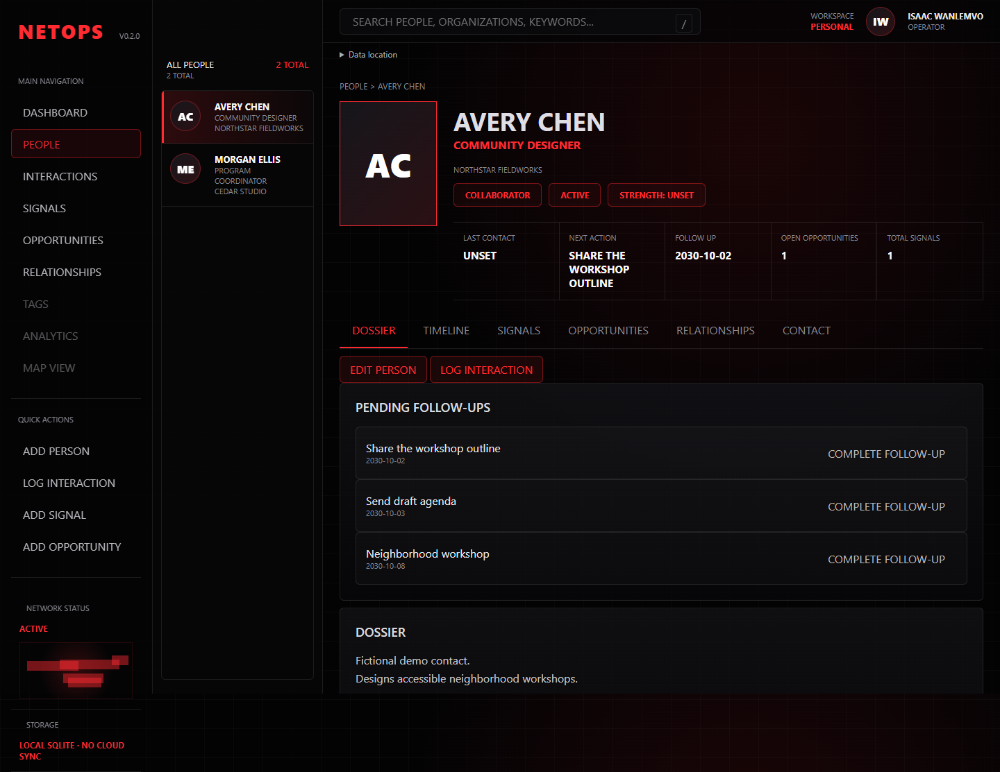

# NetOps

A local desktop workspace for remembering people, reviewing relationship history, and following through.
Built for one operator who wants their records in a portable SQLite database rather than a cloud account.



## What works

Open a standalone People directory and read each person's case file in the full content area.
Edit or append individual dossier sections, view earlier revisions, manage photos and reusable tags,
record multi-person interactions, capture typed Intel with provenance, and track independently dated
relationship types. Timeline derives history from those records and follow-up completions.
Opportunities and contacts remain available within profiles. Changes persist across restarts.
The desktop GUI uses pywebview and Edge WebView2. Existing CLI/TUI commands remain secondary interfaces.

## Start from source (Windows)

Use Python 3.12 for the tested desktop/build environment. The package supports Python 3.11+.
Microsoft Edge WebView2 Runtime is required for the Windows desktop window.

```powershell
python -m venv .venv
.venv/Scripts/python -m pip install -e '.[gui,dev]'
.venv/Scripts/netops-gui.exe
```

For a fictional demo, first run `.venv/Scripts/python -m netops.demo --database artifacts/demo/netops.sqlite3`,
set `$env:NETOPS_DB = (Resolve-Path artifacts/demo/netops.sqlite3).Path`, then launch the GUI.
Demo creation refuses an existing database. Normal startup never seeds personal or demo records.

## Windows portable build

Extract the complete release ZIP, then open `netops/netops-gui/netops-gui.exe`.
Keep `.netops-portable` and the `data` folder beside the executable folders when moving it.
The distribution contains no database; first launch creates one. For existing records,
follow [backup and upgrade instructions](docs/data-and-backups.md).

Build from a clean committed checkout using Python 3.12:

```powershell
.venv/Scripts/python -m pip install -r requirements/windows-build.txt
.venv/Scripts/python -m pip install --no-deps -e .
./scripts/build-portable.ps1
```

Output is under `dist/netops-0.2.0-<commit>/`, with a ZIP, SHA-256 file and embedded build manifest.
Each manifest identifies the clean source commit and installed dependency versions. Repeat the build
in a fresh checkout or move the prior generated output aside; the builder refuses to overwrite it.
Dependency pinning makes the build procedure repeatable; bit-for-bit identical binaries are not claimed.

## Tests and package validation

```powershell
.venv/Scripts/python -m pytest -q
.venv/Scripts/python -m build
.venv/Scripts/python -m playwright install ffmpeg
$env:NETOPS_BROWSER_TESTS = '1'
.venv/Scripts/python -m pytest tests/integration/test_gui_browser.py -q
```

Windows browser tests use installed Microsoft Edge. Linux CI installs Playwright Chromium.
See [verification](docs/verification.md) for actual results and the distinction between browser,
backend and native Windows desktop checks. [Demo captures and script](docs/demo/README.md).

## Your data

Expand **Data location** in the GUI to see the active database. Portable installs use `data/netops.sqlite3`.
Source installs default to `~/.netops/netops.sqlite3`. `NETOPS_DB` overrides the database;
otherwise `NETOPS_HOME` selects an application root. Back up the database and photo assets together.
No automatic synchronization, database merging, or encryption is provided.

## Limits and project notes

Network Map is a disabled future destination; Analytics is absent. Tags, photo management, Intel
and relationship history work in the GUI. This is a local single-user application, not a
hosted service. Do not expose its HTTP server on a network. No AI capability or production-readiness
claim is made. No project license has been selected; resolve licensing before public distribution.

[Architecture](docs/architecture.md) · [Roadmap](docs/roadmap.md) ·
[Feature evidence](docs/feature-inventory.md) · [Reconciliation provenance](docs/provenance.md) ·
[Release notes](docs/release-notes.md)

[Repository and packaging decisions](docs/repository-guidance.md)

[Current case-file iteration and verification](docs/casefile-iteration.md)
