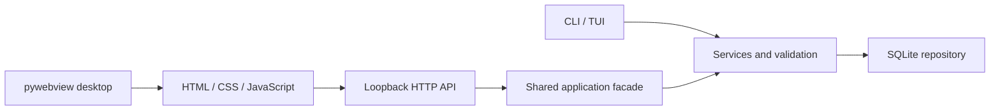

# Architecture

The primary interface is the existing HTML/CSS/JavaScript GUI hosted in a pywebview EdgeChromium
window. A loopback Python HTTP server serves packaged assets and translates requests into the
NetworkOpsBackend facade. The facade uses shared people, interaction and follow-up services;
repositories handle SQLite mapping. CLI/TUI surfaces use the same underlying services.

Each HTTP request owns and closes its database connection. Nested repository writes share the
outer service transaction, so compound person/contact saves roll back together. Migration scripts
and their version records commit atomically. Legacy tables and append-only raw notes are retained.

Schema 5 added completion timestamps to people, interactions and opportunities. Completing a follow-up
preserves its original context; rescheduling clears completion. Person edits reset completion only
when schedule/action changes. Dated historical interactions are recovered into the pending list.
An opportunity follow-up can be completed without closing the opportunity itself.

Schemas 6–10 add dossier sections and scoped revisions, persistent type vocabulary, Intel provenance
and revisions, independently dated relationship episodes and revisions, and immutable follow-up
completion events. Original `people.dossier` text is retained; headings project into stable section IDs
until a correction is saved separately. Markdown is rendered with raw HTML and image embedding disabled.
Section editors accept ordinary text; Append preserves existing formatting, and Edit retains the prior
version in history. Photo uploads normalize still JPEG/PNG/WebP images into portable JPEG assets.

`storage/catalog.py` is the application tag/type catalog. Migration unions legacy JSON assignments
with normalized taggings without deleting historical tag IDs. Equivalent whitespace/case labels are
one application choice. GUI writes use normalized taggings and update the compatibility JSON cache.
Relationship rows each represent one type/episode: ending Friend does not affect Coworker, and a
later Friend episode gets a new ID. Direction is source → target; roles are never silently reversed.

`services/intelligence.py`, `services/relationships.py`, and `services/casefile.py` validate scoped
writes and retain meaningful prior content. Their histories are not a general audit system.
`services/timeline.py` derives chronology from structured records. Unknown event dates remain unknown;
recording timestamps are explicitly labeled. Imported prose never generates confirmed timeline events.

The top bar persists across screens. Navigation collapse changes CSS and localStorage only.
People directory state is separate from the selected profile and its tabs. Global and profile creation
share forms; global creation never borrows a hidden selected person. Interaction participants are a
visible searchable multi-select. Dates default from local calendar components, not UTC serialization.

The GUI delegates clicks from stable containers so newly rendered controls work. Tabs show records;
Add controls open forms. Errors retain draft input, pending submissions disable Save, and successful
creation selects the returned ID. Duplicate names remain distinct records.

New API operations: GET /api/settings reports the actual database file; POST
/api/follow-ups/{kind}/{id}/complete persists idempotent completion; PATCH
/api/follow-ups/{kind}/{id} changes follow_up_date. A null date retains an unscheduled interaction
follow-up; a person still needs a next action, and an opportunity without a date has no scheduled follow-up.
Kinds are person, interaction and opportunity. Unsupported kinds return 400; missing records 404.

Portable roots are selected using a marker or existing sibling data, independent of outer folder name.
Environment overrides take precedence. Ambiguous candidates stop startup. New photo copies use paths
relative to the database directory; moved legacy absolute references get an assets-directory fallback.

The application remains local and single-user. The HTTP bridge has no authentication or remote hosting
contract. Browser writes require JSON and a same-origin request. No cloud, encryption or AI service is
implemented. Retaining the service facade leaves a future integration boundary without adding one now.
