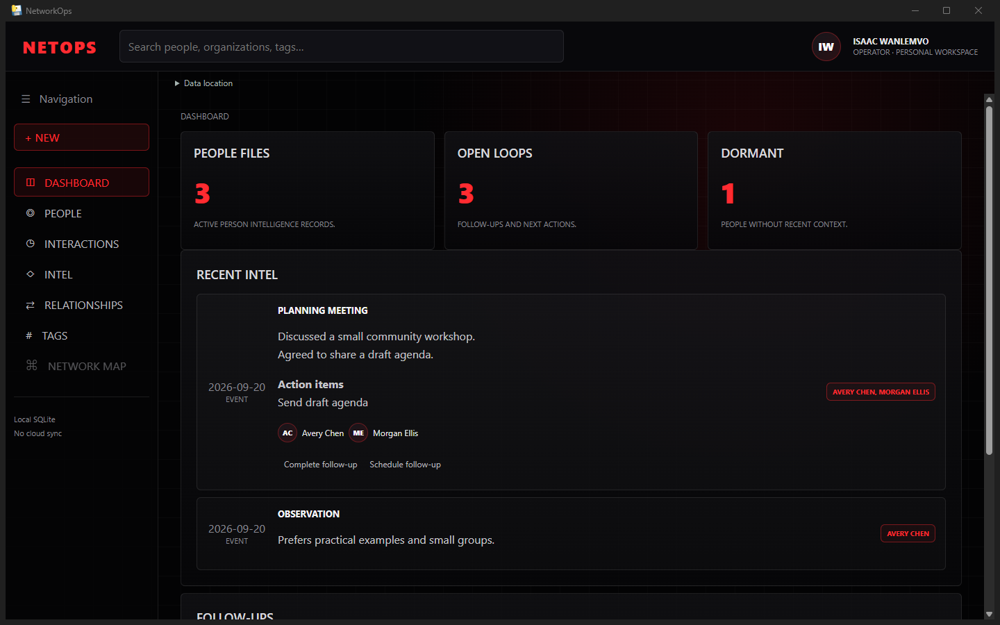
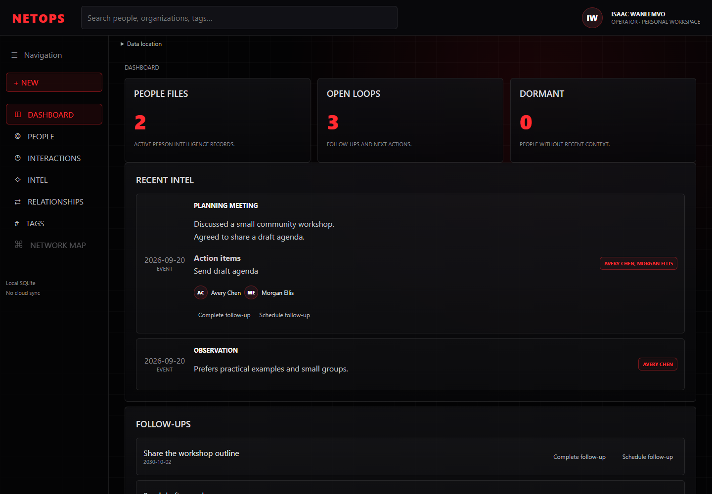
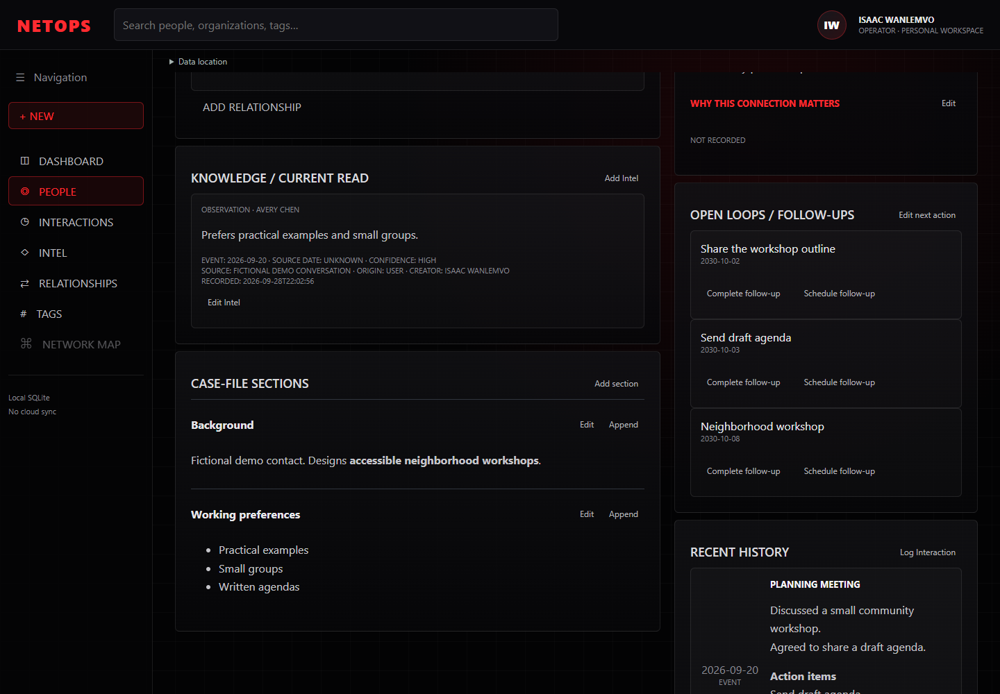

# Fictional demo

All names, organizations, interactions and contact details in these captures are fictional.
The screenshots show the running application, not mockups. The recording is an automated browser
workflow against the same GUI assets and backend; it is not a recording of the native window.

[Watch the recorded workflow](workflow.webm). The separate native capture below is from the
rebuilt Windows executable with an isolated fictional database.

These captures show the case-file iteration built from `94470158`. To inspect it locally, open
`artifacts/NetOps Casefile Preview/Open NetOps Preview.cmd`. The preview contains fictional data
and explicitly selects its separate database. The distributable ZIP contains no database.



Create a separate dataset from the repository root:

```powershell
.venv/Scripts/python -m netops.demo --database artifacts/demo/netops.sqlite3
$env:NETOPS_DB = (Resolve-Path artifacts/demo/netops.sqlite3).Path
.venv/Scripts/netops-gui.exe
```

For repeatable screenshots and a workflow recording:

```powershell
.venv/Scripts/python -m playwright install ffmpeg
$env:NETOPS_BROWSER_TESTS = '1'
$env:NETOPS_CAPTURE_DIR = 'docs/demo'
.venv/Scripts/python -m pytest tests/integration/test_gui_browser.py -q
```

On Linux, install Playwright Chromium instead. Tests create fresh temporary databases.
Capture script: inspect Dashboard → People directory → Avery dossier and rendered sections → search
for a missing person → add Rowan Quinn → demonstrate validation/network draft preservation → edit and
append a section → inspect history → log a shared interaction and complete its follow-up → add contact,
Intel, opportunity and relationship → reload → distinguish duplicate names → verify navigation collapse.
The second browser regression additionally covers photo preview, inline tags, Intel revisions, and
independent relationship endings/restarts.





